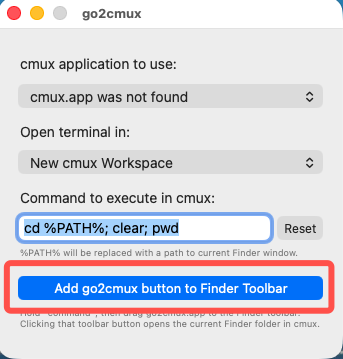
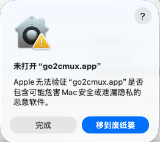
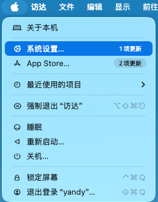
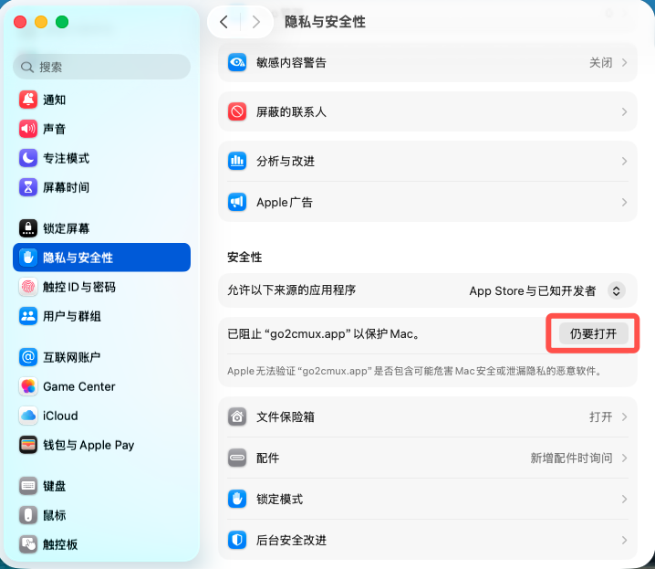
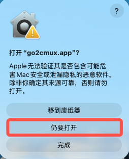
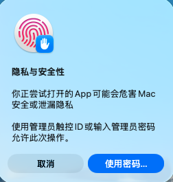

# go2cmux

English | [简体中文](README.zh-CN.md)

`go2cmux` is a tiny macOS helper app for opening the current Finder folder in [`cmux`](https://github.com/manaflow-ai/cmux).

It is designed for the same workflow as tools like Go2Shell: add the app to the Finder toolbar, click it, and jump straight from the current Finder location into your terminal app. The difference is that this project targets `cmux`.

Download the prebuilt app: [GitHub Releases](https://github.com/hyc-dev-spec/go2cmux/releases)

## What It Does

When you click `go2cmux` from the Finder toolbar, it:

1. Reads the current folder from Finder
2. Launches `cmux` if needed
3. Opens that folder in `cmux` using the selected mode

The current implementation is intentionally small and focused. It does not modify `cmux`, and it does not depend on a locally built development copy of `cmux`.

## Why This Exists

`cmux` already supports opening folders, but older Finder helpers such as Go2Shell typically only know how to open classic terminal apps like Terminal.app or iTerm. `go2cmux` fills that gap with a dedicated Finder launcher for `cmux`.

## Requirements

- macOS
- A locally installed copy of `cmux`
- Xcode if you want to build from source (`build.sh` uses `actool` to compile the app icon asset catalog)

For runtime, `go2cmux` looks for `cmux.app` in this order:

1. The app registered with bundle identifier `com.cmuxterm.app`
2. `/Applications/cmux.app`
3. `~/Applications/cmux.app`

## Permissions

`go2cmux` uses Apple Events / automation to talk to:

- Finder, to read the current folder
- `cmux`, to create a workspace

The first time you use it, macOS may ask you to allow `go2cmux` to control Finder and `cmux`. If access is denied, the app shows a targeted error message that tells you which permission is missing.

## Build

You can build the app in either of these ways:

1. Open [`go2cmux.xcodeproj`](go2cmux.xcodeproj) in Xcode and build the `go2cmux` target
2. Run the build script from Terminal

The repository includes a build script that creates an ad-hoc signed app bundle:

```bash
./scripts/build.sh
```

Build output:

```text
build/go2cmux.app
```

The script:

- copies `Resources/Info.plist` into the app bundle
- refreshes `AppIcon.appiconset` from `Resources/AppIcon-1024.png`
- compiles `Sources/go2cmux/AppDelegate.swift` and `Sources/go2cmux/main.swift` with `swiftc`
- compiles the asset catalog with `actool`
- signs the resulting `.app` with ad-hoc `codesign`

## Use

After opening `go2cmux.app`, you can click the button shown below in the settings window to add it to the Finder toolbar.
(Or you can hold `Command` and drag `go2cmux.app` into the Finder toolbar manually.)



When using it from the Finder toolbar:

1. Click the `go2cmux` icon in the toolbar to open the current Finder folder in `cmux.app`

Expected behavior:

- If `cmux` is already running, `go2cmux` opens the current Finder folder using the selected mode
- If `cmux` is not running, `go2cmux` launches it first and then opens the folder

## [Prebuilt Version](https://github.com/hyc-dev-spec/go2cmux/releases)

If you use a [Prebuilt Version](https://github.com/hyc-dev-spec/go2cmux/releases), Gatekeeper may block it the first time because the app is not notarized by Apple. In that case:

1. Try opening `go2cmux.app` once, and click **Done** when the warning appears



2. Open **System Settings**



3. Go to **Privacy & Security**, then click **Open Anyway**



4. In the second confirmation dialog, click **Open Anyway** again



5. If macOS asks for it, authenticate with Touch ID or an administrator password



## Project Layout

- `Sources/go2cmux/AppDelegate.swift`: app logic
- `Sources/go2cmux/main.swift`: app entry point
- `go2cmux.xcodeproj`: minimal Xcode project
- `Assets.xcassets/AppIcon.appiconset`: compiled app icon asset catalog
- `Resources/Info.plist`: app bundle metadata
- `scripts/build.sh`: local build script
- `scripts/update_appiconset.sh`: syncs the icon set from the master PNG

## Known Limitations

- This is a macOS-only project
- It depends on `cmux` being installed locally

## License

This project is licensed under the MIT License. See the `LICENSE` file for details.
